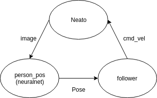
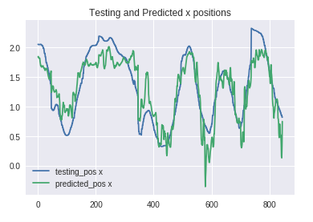
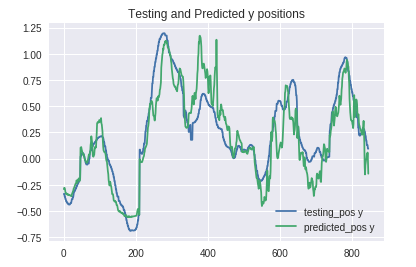
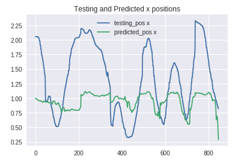
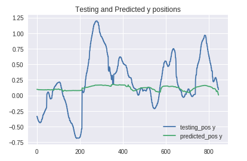

# link to colab nb: https://colab.research.google.com/drive/1y01tJtKJqs_qB1H2FXziHm02NfxJUSO0 

# Project Goal
In this project, our goal was to track a person and always keep them in frame at a distance from one meter away.

# How did we approach the problem?
Since this was a machine learning based project, we decided to use a neural network that would predict the position of a subject in frame using the Neato’s camera.

## The Neural Net
To gather data, we placed the neato in a fixed location, while one of us walked in various paths in front of the neato to cover depth and horizontal location. The subject held an iPhone running an ARKit app that published its pose estimate. Meanwhile a script logged images from the neato as well as the phone’s position, which respectively constituted the training input and output for our neural network. As a first pass, we decided not to move the neato during data gathering in the hope of making the prediction work in this easier case and later improve the neural network. 

Our network architecture includes a varying number of convolution/maxpooling pairs (convolution to extract features and maxpooling to reduce dimensionality), dropout layers (to prevent overfitting), and several decreasing dense layers to infer object position from the extracted features. Below is our most effective architecture. You’ll notice that it does not feature a dropout layer.

Layer (type)                 Output Shape              Param #   
=================================================================
input_3 (InputLayer)         (None, 120, 160, 3)       0         
_________________________________________________________________
conv2d_6 (Conv2D)            (None, 120, 160, 32)      896       
_________________________________________________________________
max_pooling2d_6 (MaxPooling2 (None, 60, 80, 32)        0         
_________________________________________________________________
conv2d_7 (Conv2D)            (None, 60, 80, 64)        18496     
_________________________________________________________________
max_pooling2d_7 (MaxPooling2 (None, 30, 40, 64)        0         
_________________________________________________________________
conv2d_8 (Conv2D)            (None, 30, 40, 128)       73856     
_________________________________________________________________
max_pooling2d_8 (MaxPooling2 (None, 15, 20, 128)       0         
_________________________________________________________________
flatten_2 (Flatten)          (None, 38400)             0         
_________________________________________________________________
dense_6 (Dense)              (None, 16)                614416    
_________________________________________________________________
dense_7 (Dense)              (None, 8)                 136       
_________________________________________________________________
dense_8 (Dense)              (None, 2)                 18        
=================================================================
Total params: 707,818
Trainable params: 707,818
Non-trainable params: 0

## Neato Implementation

The implementation on the Neato is very straightforward:
The person_pos script obtains an image from the Neato, performs appropriate transforms to it (only resize currently), and feeds it through the neuralnet which outputs a Pose message
The follower script obtains the Pose message, finds the distance and angle to the position, and applies proportional control to calculate a command velocity to center the person in frame at a distance 1m away. The command velocity is published to a node for the Neato.

# Describe design decision we made
The first important decision we made was to make the neural network predict subject position instead of commands to keep the subject in frame. This felt more useful as the robot could then do other things with that information (such as orbit around the subject). It also felt easier to get a good dataset, which leads us to our next decision. 

We also decided to use ARKit as ground truth. This meant we didn’t have to deal with intermediate proxies for the subject position (such as position in the image or estimate from laser scan). It was fairly effective, though we did notice drift on the order of 15 cm after collecting data. 

We also briefly considered modeling the subject’s velocity by comparing subsequent frames, but decided on making that a stretch goal.

# Results

 

At our best, the neural net predicted the person’s position in validation data set the quite well. Certain peaks aren’t well matched and the prediction is relatively noisy, but overall the correlation is clear. However, when we tested it in the same place wearing the same clothes … the neural net completely failed. We didn’t use the same Neato, so it’s possible there were differences in the camera quality and angle. We would expect that to perhaps produce offset or scaled results, but the predictions were significantly more flawed than that. It placed the subject further in images when the subject is close to the camera than when it is further away. This indicates that the model seriously overfit on both the training and validation dataset - which isn’t too crazy since they were taken from the same recording session. We tried adding dropout layers in the middle of the convolution, but that completely shot the neural net’s ability to make predictions. 

# What if any challenges did you face along the way

The main challenge working with this neural net was the general guess-and-check nature of tuning the algorithm, and trying to understand what the network was valuing in order to make appropriate changes. This led to the failure to get the neuralnet working in real time on a Neato, probably because of overfitting issues.

Neither of us were particular experts in the art of neuralnet design, so while tuning our algorithm, it came down to “throw another layer of convolution at it” or “throw in some dropout” without much insight into what effect that would have. We did eventually zero in on an algorithm that predicted the testing data rather beautifully (with some noise), and considered that a major success.

...However, it didn’t work in real time on the Neato. When we implemented the neuralnet, it bizarrely predicted y values that were not centered around 0 at all, and x values that were reversed from what they should have been. We aren’t sure why this happened, but we assume that the error most likely comes from overfitting while training, as well as noise from the predictions.

# What would we do to improve our project if we had more time?

There are several improvements we could make to this project. These include making further visualizations for analysis, data manipulation, training for different parameters, and noise filtering on the outputs.

## Visualizations
Probably the most essential change is to add post-mortem visualizations to see what the neuralnet is valuing in the images we give it. As is, we don’t know what the net is looking at, so whatever hopeful changes we make to the data are based on our assumptions of what might be going wrong. It would be extremely helpful to know whether the net was looking at the person’s feet, legs, or something random in the surroundings. The only reason we don’t have this implemented were bizarre package distribution errors in necessary visualization add-ins, which we didn’t have time to fix before the due date.

## Data Manipulation
We’ve hypothesized many possible changes to the data sets that might help train the neural net to be more accurate and flexible:

Check for drift in obtained positions
Or rather, fix the drift we know is in the positions. ARkit is a great tool to get ground truth position measurements to go with the images, but it does drift over time. This means that the data set we used was inconsistent with its image and position matches, which could definitely have an effect on the accuracy of our model. With more time, this was a very obviously need fix. A first attempt would be to model the drift linearly eg. if y starts at 0.0 and ends at 0.10, then at the halfpoint add a -0.05 offset to the y. 
Shift images to black and white rather than colored
The idea here is that we can train the net to function even when the person or environment has different colors than the training set (for example, if the person in the training images is wearing black pants, but the person in real life is wearing blue). This would reduce the layers of the image as well, giving the net fewer parameters to fit (or overfit) to.
Train in different environments
We obtained our dataset with all one environment and using the same person in the same outfit with the idea that it would be the simplest possible test case: The validation would be if it could follow the same person in the same place. However, this may have been misguided. If we took data from different environments, it could decrease the chance that the net’s taking bad clues from the background, because the person would be the consistency between different images.
Change camera angle
Besides the probability that the camera angle in person was different than that used while obtaining training images, it may have been better to angle it so that the entire person was visible. It would be interesting to see if this could work any better with more of a concept of “person” rather than “legs”, and is more in line with the original project goal of person tracking.

## Training for different parameters
There were two major modifications we could have made to the design of our neuralnet that could have helped with our project goal:

Train a second neuralnet to detect whether there is a person in the frame at all
We realized partway in that our dataset had only examples of a person in the frame, so when there was no one there was no telling what it would predict. This is a pretty essential detection ability for our goal behavior, so it would be an important next step to implement (though it doesn’t necessarily have to be another neuralnet).
A blogpost from [Uber](https://eng.uber.com/coordconv/) notes that standard CNN architectures fail to keep track of spatial information. Their fix is to add two channels, one that encodes the x pixel position, one that encodes the y pixel position. This allows a filter to access information about the pixel’s position in the image during a convolution. 

## Noise filtering
We got a lot of noise in the predicted positions from the neuralnet. This fluctuation could explain some of the false predictions in real time. The simple solution is to add something like a low pass filter to the prediction-- essentially, store the last 10 or so predictions and find some reasonable average between them. This would smooth out the noise in the predictions and maybe get a more accurate output.

## Investigation into strange outputs
One of the models we generated predicted direction of movement, but at a fraction of the amplitude (if the person moved 1m to the left, it predicted 10cm to the left). This was the only model with a dropout layer (and a significant one at that-- it dropped half the data), which we thought would help with the overfitting problem. The actual results we got are honestly baffling, and worth looking into with some extra time.

This is the architecture of the odd neural net:

And here are the results with the strange amplitudes:

 

# Did we learn any interesting lessons for future robotic programming projects?

Charlie: 
- As a general note, I realized (with Matt’s help) an interesting insight during this project about the nature of time put into something vs. quality of output. There’s a whole spectrum of work where the output is very obviously a product of the time you put into it (5 hours of drawing makes art that looks like it took about 5 hours at your skill level) to output that doesn’t so obviously prove the input. At this point of my experience in computational robotics, that output isn’t very obvious-- most of the time put in is spent learning or flailing with new concepts, which doesn’t always produce a satisfying project. It’s very different than a project where you know what needs to be done, but it will just take 12 man hours. I think the lesson I learned here is about mentally framing my expectation of output in this class according to the objective time spent on it and my estimate of skill level.
- More specifically to this project, wow, neural networks are a terrifying tool. I think my time is better spent exploring more trustworthy algorithms, where the mechanics of what’s going on are far more obvious/intentionally designed.

Matt:
- It’s very difficult to choose a well scoped project when you don’t have any idea how difficult it is to implement something using a specific technology.
- It is worth investing time in making the dataset collection and processing fast and painless, as a significant portion of the problems with a neural net comes from the data it learns from, and it is unlikely to get it right the first time around. 
- It’s really helpful to have someone explain standard neural network architectures and their motivation before haphazardly slapping random layers together. (Charlie agrees)
- Also, when people say that your validation dataset should be actually different than training, they’re right. 
